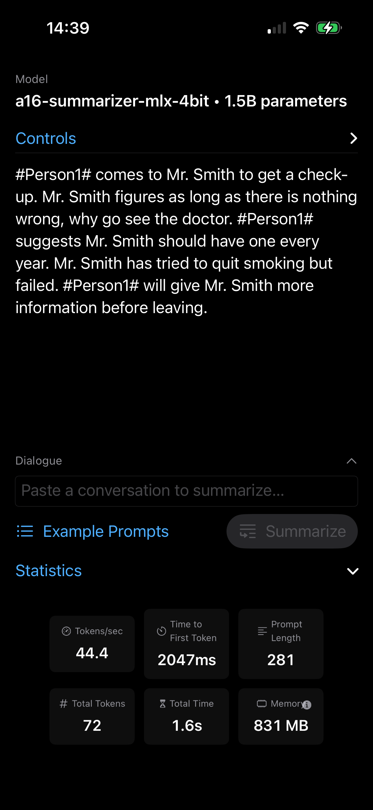
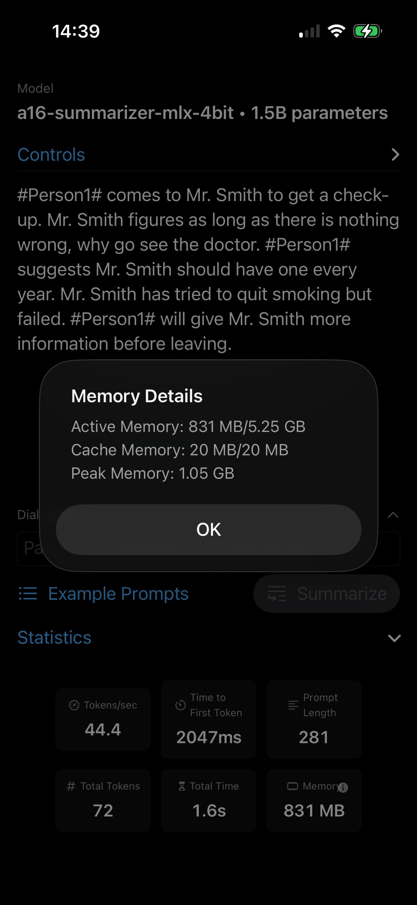

# On-Device Dialogue Summarizer

A LoRA fine-tune of a small language model that runs fully on an iPhone 14 Pro (A16),
a device Apple decided was too constrained for Apple Intelligence. The idea was to
reproduce Apple's own on-device recipe (small base model, LoRA task adapter, aggressive
quantization) with my own model, and actually get it running natively on the phone.

Apple draws the on-device LLM line at the A17 Pro with 8 GB of RAM. This repo shows a
scoped, task-specific summarizer working below that line on an A16 with 6 GB, and tries
to document why the tradeoffs (model size, bit width, memory) make that possible.

## What this covers

- QLoRA fine-tuning with PEFT, on a single RTX 3080
- ROUGE evaluation on a held-out test split, base vs fine-tuned
- 4-bit quantization and conversion to MLX
- A SwiftUI app using MLX Swift, running on the GPU (Metal)
- Profiling on real hardware: tokens/sec, peak memory, model size

## Stack

Picked mainly for clean licensing and on-device fit.

| Piece | Choice | License | Why |
|-------|--------|---------|-----|
| Base model | `Qwen/Qwen2.5-1.5B-Instruct` | Apache 2.0 | Apache-licensed (the 3B isn't); 847 MB at 4-bit, fits in 6 GB RAM |
| Dataset | DialogSum | MIT | Dialogue summarization, and repo-safe (SAMSum is CC BY-NC-ND) |
| Training | PEFT + TRL + bitsandbytes | - | QLoRA on the RTX 3080 (CUDA) |
| Runtime | MLX Swift | - | Apple-native, runs on A16, loads models straight from HF |
| Stretch | Core ML | - | More Apple credibility, but only worth attempting after MLX works |

## Repo and Hub layout

The code lives here on GitHub. Weights and data never touch this repo; the trained
artifacts live on the Hugging Face Hub and are referenced by ID:

- Code (this repo): `osyounis/a16-summarizer`
- Quantized MLX model (what the app loads): `https://huggingface.co/osyounis/a16-summarizer-mlx-4bit`

## Quickstart

```bash
# On the RTX 3080 box (CUDA):
pip install -r requirements-train.txt
python train/prepare_data.py
python train/train_lora.py
python train/merge.py
python train/eval_rouge.py        # writes results/rouge_comparison.md

# On the M2 Mac (MLX is Apple-silicon only):
pip install -r requirements-convert.txt
python convert/to_mlx.py --upload-repo osyounis/a16-summarizer-mlx-4bit

# App: see app/README.md
```

---

## Model Card

**Model:** `osyounis/a16-summarizer-mlx-4bit`
**Base model:** `Qwen/Qwen2.5-1.5B-Instruct` (Apache 2.0)
**Fine-tuned on:** DialogSum (MIT), dialogue to abstractive summary
**Method:** QLoRA, rank 16, alpha 32, 2 epochs
**Quantization:** 4-bit (MLX), group size 64 (4.501 effective bits/weight)

### Results

DialogSum test split, 500 dialogues, multi-reference ROUGE (max f-measure over the 3
human reference summaries per dialogue; 10 dialogues end up with 2 after identical
annotations are deduped). All models decoded the same way: greedy, `max_new_tokens=96`.

| Metric | Base (Qwen2.5-1.5B) | Fine-tuned (fp16 merged) | 4-bit MLX (on-device) | Δ tuned vs base |
|--------|--------------------:|-------------------------:|----------------------:|----------------:|
| ROUGE-1 | 0.3706 | 0.5581 | 0.5433 | +0.1875 |
| ROUGE-2 | 0.1498 | 0.3101 | 0.2905 | +0.1602 |
| ROUGE-L | 0.2889 | 0.4808 | 0.4622 | +0.1919 |

All three tuned-vs-base deltas have a 95% CI excluding zero (paired bootstrap over
dialogues, 10k resamples). The 4-bit MLX column is the model the app actually ships.
Quantization costs about 1.5 to 2 ROUGE points (biggest on ROUGE-2, -6.3% relative) with
no degeneration: recall is basically unchanged, and the small loss is precision from
slightly looser output. The 4-bit model was scored with identical decoding and scoring,
so the columns are directly comparable. Full reports:
[`results/rouge_comparison.md`](results/rouge_comparison.md) (base vs fp16),
[`results/rouge_mlx_4bit.md`](results/rouge_mlx_4bit.md) and
[`results/quantization_delta.md`](results/quantization_delta.md) (fp16 vs 4-bit).

One caveat worth spelling out: the delta is register calibration more than comprehension.
The base model's ROUGE-1 recall (0.616) is actually a touch higher than the fine-tune's
(0.604). It recovers the reference content fine, and it writes well-formed third-person
summaries without being asked to. But it averages around 68 tokens against 27.8-token
references, so its precision collapses (0.277 vs 0.540). What the fine-tune learned is
DialogSum's length and house style. For a task-scoped summarizer that is exactly the job,
but it would be wrong to read this as "the base model can't summarize". It can; it just
doesn't stop. Side-by-side outputs, including the case where the fine-tune does worst,
are in [`results/qualitative_examples.md`](results/qualitative_examples.md).

### On-device (iPhone 14 Pro, A16, 6 GB)

| Measure | Value |
|---------|------:|
| Model size on disk | 847 MB (4-bit MLX) |
| Prefill / decode tokens/sec | ~137 / 44.4 |
| Peak memory | 1.05 GB (831 MB active) |

Measured in the on-device app ([`app/`](app/)) summarizing the sample dialogue: 281-token
prompt, greedy decoding at temperature 0. Prefill is prompt tokens divided by
time-to-first-token (2.05 s); decode is 44.4 tok/s sustained. The
`increased-memory-limit` entitlement raises the process ceiling to about 5.25 GB on the
6 GB device (the app reports 831 MB active out of 5.25 GB), so the 1.05 GB peak leaves
plenty of headroom.

| Running on iPhone 14 Pro | On-device memory (active / cache / peak) |
|:---:|:---:|
|  |  |

### Intended use and limits

Task-specific dialogue summarization, built as a demonstration. It is not a general
chatbot, and it inherits Qwen2.5's limitations plus the quantization quality loss.
English only, since DialogSum is English.

## License

Code: MIT (see `LICENSE`). Model derivative: Apache 2.0 (inherits Qwen2.5). See `NOTICE`.
